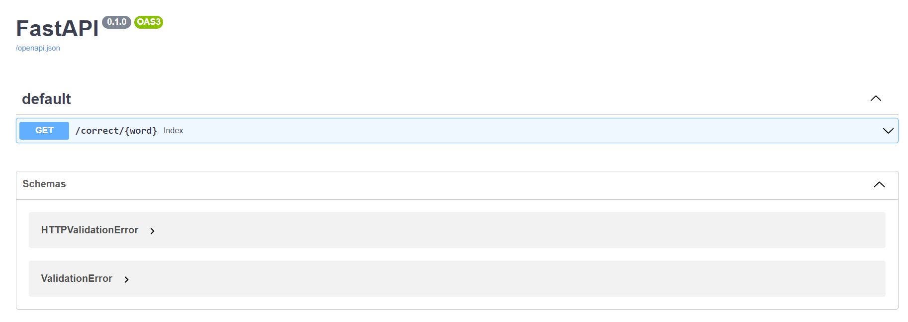
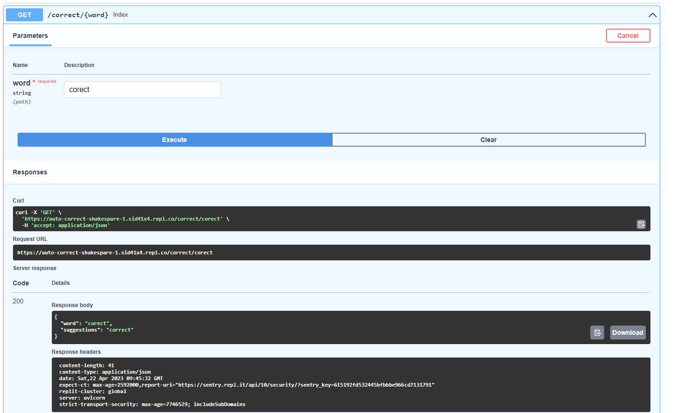

# Auto Correct with Probabilistic Model

This repository contains a Python implementation of an auto correct system based on a probabilistic model. The system uses a corpus of Shakespearean texts to train the model and make suggestions for correcting input text. The implementation is deployed using FastAPI.

to try it you Navigate to **[https://auto-correct-shakespear.onrender.com/docs](https://auto-correct-shakespear.onrender.com/docs)**

## Architecture

The project consists of the following components:

* **models.py:** This file contains the implementation of the auto correct class based on the probabilistic model. The model is trained using the corpus of Shakespearean texts provided in the `corpus.csv` file.
* **main.py:** This file contains the implementation of the FastAPI application, which serves as the interface for the auto correct system. The application receives input text from the user, passes it to the auto correct model for processing, and returns a corrected version of the input text.
* **corpus.csv:** This file contains the corpus of Shakespearean texts used to train the auto correct model. The file contains a collection of sentences from various works of Shakespeare.
* **requirements.txt:** This file contains a list of Python dependencies required to run the application.

## Getting Started

To run the auto correct system locally, follow these steps:

1. Clone the repository: `git clone https://github.com/sid41x4/auto-correct-shakespeare.git `
2. Install the required dependencies: `pip install -r requirements.txt`
3. Start the FastAPI application: `uvicorn main:app --reload`
4. Open a web browser and navigate to `http://localhost:8000/docs`

You should now be able to enter input text and receive corrected suggestions from the auto correct system.

## Usage

* Navigate to [ https://localhost:8000/docs]()

sad

Try Out an example for example word : "corect" the correct word is "correct"

